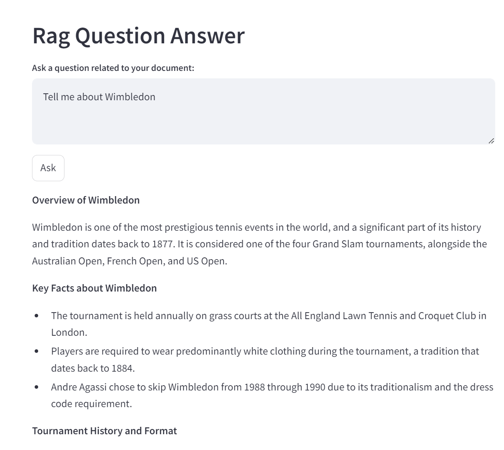

https://www.youtube.com/watch?v=1y2TohQdNbo&t=225s


## Setup

```
ollama pull llama3.2:3b

pip install ollama chromadb sentence-transformers streamlit pymupdf langchain-community

ollama pull nomic-embed-text
```

first success


Chroma db created

Can I succesd 3 mb file

3 mb file is not instantaneous

takes more than 5 min

sada


finally workedd



when asked about something irrelevant


```
                                                ^^^^^^^^^^^^^^^^^^^^^^^^^^^^
  File "C:\Users\aonno\.conda\envs\privategpt\Lib\site-packages\chromadb\api\types.py", line 61, in normalize_embeddings
    raise ValueError(
ValueError: Expected Embedings to be non-empty list or numpy array, got [] in upsert.
```

This could be a result of database corruption

this was resolved by pulling the model again from the repository

ollama pull llama3.2:3b

pip install ollama chromadb sentence-transformers streamlit pymupdf langchain-community

ollama pull nomic-embed-text

Final


